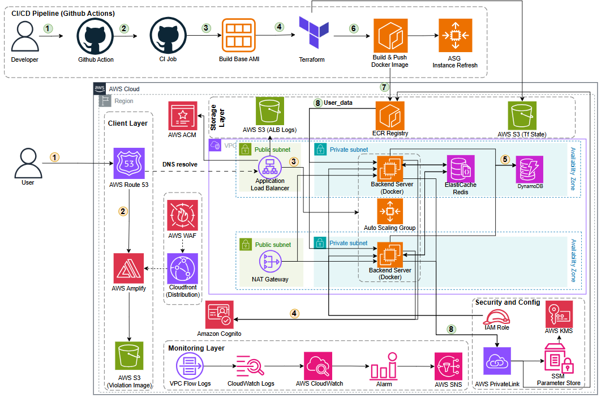

# EduTrust - AI Educational Assistant


> **EduTrust** is an AI-powered educational assistant platform built for schools. It combines a smart routing AI agent (Pydantic AI + LiteLLM) with a full exam management system including proctoring, real-time monitoring, and multi-role authentication.



## Table of Contents

- [Overview](#overview)
- [Tech Stack](#tech-stack)
- [System State Machine](#system-state-machine)
- [DynamoDB Schema](#dynamodb-schema)
- [Getting Started](#getting-started)
- [Project Structure](#project-structure)
- [Deployment](#deployment)

---

## Overview

EduTrust consists of two parts:

| Component | Description |
|-----------|-------------|
| **AI Agent** | ReAct-style reasoning agent that routes queries to specialist sub-agents (Math, Science, Literature, Web Search) via Pydantic AI + LiteLLM |
| **Exam System** | Full exam lifecycle management with secret keys, time-windowed access, auto-scoring, and proctoring via violation logging |

---

## Tech Stack

### Backend

| Category | Technology |
|----------|------------|
| Framework | [FastAPI](https://fastapi.tiangolo.com/) 0.128+ |
| AI Agent | [Pydantic AI](https://ai.pydantic.dev/) 1.51 + [LiteLLM](https://docs.litellm.ai/) 1.77 |
| Database | AWS [DynamoDB](https://aws.amazon.com/dynamodb/) (boto3) |
| Cache | Redis (ElastiCache) |
| Auth | AWS [Cognito](https://aws.amazon.com/cognito/) (JWT, 3 user groups) |
| Rate Limiting | [SlowAPI](https://github.com/laurentS/slowapi) |
| Observability | [Logfire](https://logfire.pydantic.dev/) (FastAPI instrumentation) + Langfuse (optional) |
| Python Pkg Manager | [UV Astral](https://docs.astral.sh/uv/) |

### Frontend

| Category | Technology |
|----------|------------|
| Framework | [Next.js](https://nextjs.org/) 15 (App Router) |
| UI | [React](https://react.dev/) 19 + [Tailwind CSS](https://tailwindcss.com/) v4 |
| Math Rendering | [KaTeX](https://katex.org/) + [react-markdown](https://remarkjs.github.io/react-markdown/) |
| AI UI | [@openai/apps-sdk-ui](https://openai.com/) |

### Infrastructure

| Category | Technology |
|----------|------------|
| IaC | [Terraform](https://www.terraform.io/) 1.14+ (AWS provider 6.34) |
| CI/CD | [GitHub Actions](.github/workflows/ci.yml) |
| Container | Docker (multi-stage, Ubuntu 24.04 base) |
| Compute | AWS EC2 + Auto Scaling Group + Launch Template |
| Load Balancer | AWS Application Load Balancer (ALB) |
| Cache | AWS [ElastiCache](https://aws.amazon.com/elasticache/) Redis (cluster mode) |
| CDN + WAF | CloudFront + WAFv2 (optional) |

---

## System State Machine

```
┌─────────────────────────────────────────────────────────────────────────┐
│                         EDUTRUST SYSTEM FLOW                            │
└─────────────────────────────────────────────────────────────────────────┘

   ┌──────────┐    login     ┌──────────────┐   create exam   ┌──────────┐
   │ anonymous │────────────▶│  authenticated │───────────────▶│ teacher  │
   └──────────┘              └──────────────┘                │  admin   │
        │                           │                        └────┬─────┘
        │                           │                             │
        │                     refresh token                        │ add students
        │                           │                             │
        │                           ▼                             ▼
        │                    ┌──────────────┐               ┌──────────────┐
        │                    │   expired   │               │ exam ready   │
        │                    │ (re-login)  │               │ (time window)│
        │                    └──────────────┘               └──────┬──────┘
        │                                                      │
        │  ┌───────────────────────────────────────────────────┘
        │  │
        ▼  ▼
  ┌──────────────────────────────────────────────────────────┐
  │                    EXAM LIFECYCLE                         │
  └──────────────────────────────────────────────────────────┘

  ┌──────────────┐  verify key   ┌─────────────┐   submit   ┌────────────┐
  │  not_started │─────────────▶│   active    │───────────▶│  submitted │
  └──────────────┘              │ (can take)  │ (completed)└────────────┘
       │                         │             │
       │ (time before start)     │ (expired)   │ (failed / disqualified)
       └─────────────────────────┼─────────────┘
                                  ▼
                               expired

  ┌──────────────────────────────────────────────────────────┐
  │               PROCTORING (parallel to exam)               │
  └──────────────────────────────────────────────────────────┘

  ┌────────────┐   violation    ┌──────────┐  severity   ┌───────────────┐
  │ monitoring │──────────────▶│ warning  │───────────▶ │ disqualified  │
  └────────────┘                └──────────┘  (high)    └───────────────┘

  ┌──────────────────────────────────────────────────────────┐
  │               AI AGENT (parallel to exam)                 │
  └──────────────────────────────────────────────────────────┘

  ┌──────┐   ask   ┌──────────┐  route   ┌───────────┐ stream ┌─────────┐
  │ idle │────────▶│ routing  │─────────▶│ delegate  │───────▶│ complete│
  └──────┘         └──────────┘          └───────────┘        └─────────┘
```

### System Modules

| Module | Description | Docs | State Machine |
|--------|-------------|------|---------------|
| [Auth](docs/04-auth.md) | Cognito authentication, OTP, session | [Link](docs/04-auth.md) | [SM](docs/04-auth.md#state-machine) |
| [Agent](docs/07-agent.md) | Pydantic AI orchestrator + sub-agents | [Link](docs/07-agent.md) | [SM](docs/07-agent.md#state-machine) |
| [Conversation](docs/08-conversation.md) | Redis cache + DynamoDB persistence | [Link](docs/08-conversation.md) | [SM](docs/08-conversation.md#state-machine) |
| [Exam](docs/05-routers.md) | Exam CRUD + submission flow | [Link](docs/05-routers.md) | [SM](docs/05-routers.md#state-machine) |
| [Detection](docs/09-detection.md) | Camera proctoring + violation logging | [Link](docs/09-detection.md) | [SM](docs/09-detection.md#state-machine) |
| [Translate](docs/10-translate.md) | LLM-powered document translation | [Link](docs/10-translate.md) | [SM](docs/10-translate.md#state-machine) |
| [Search](docs/11-search.md) | Tavily + unified web search | [Link](docs/11-search.md) | [SM](docs/11-search.md#state-machine) |
| [Database](docs/03-database.md) | DynamoDB + Redis facade | [Link](docs/03-database.md) | [Schema](docs/03-database.md#schema) |

### User Roles & Permissions

| Role | Permissions |
|------|-------------|
| `admin` | Full access — user management, class management, all exams |
| `teacher` | Create/manage exams for assigned classes, view results |
| `student` | Take exams (with secret key + time window), view own results |

---

## DynamoDB Schema

All tables use `PAY_PER_REQUEST` billing, KMS encryption at rest, and point-in-time recovery.

| Table | Partition Key | Sort Key | Global Secondary Indexes |
|-------|-------------|----------|--------------------------|
| `users` | `user_id` | — | `email-index` (email → user_id), `role-index` (role → user_id), `class-id-index` (class_id → user_id) |
| `classes` | `class_id` | — | `class-lookup-index` (lookup_key = `{grade}#{name}` → class_id), `homeroom-teacher-index` (homeroom_teacher_id → class_id) |
| `class_teacher_assignments` | `teacher_id` | `assignment_key` | — |
| `exams` | `exam_id` | — | `teacher-index` (teacher_id + start_time → exam_id), `class-index` (class_id + start_time → exam_id) |
| `submissions` | `exam_id` | `student_id` | `student-index` (student_id + submitted_at → exam_id) |
| `violations` | `exam_id` | `student_id` | `class-time-index` (class_id + violation_time → exam_id) |
| `conversations` | `conversation_id` | — | `user-updated-index` (user_id + updated_at → conversation_id) |
| `otps` | `otp_key` | — | TTL: `expire_at_epoch` |

### ElastiCache Redis

| Setting | Value |
|---------|-------|
| Engine | Redis 7.x (cluster mode enabled) |
| Port | 6379 |
| Replication | Multi-AZ (1 primary + 2 replicas) |
| Use Case | Conversation message cache, session cache |
| Security | VPC endpoint / Security Group egress control |

---

## Getting Started

### Prerequisites
- Python 3.11+ · Node.js 20+ · [UV](https://docs.astral.sh/uv/)

### Backend
```bash
cd backend
uv sync
cp .env.example .env   # configure your values
uv run uvicorn src.main:app --reload --port 8000
```
API docs: `http://localhost:8000/docs` (Swagger), `/redoc` (ReDoc).

### Frontend
```bash
cd frontend
npm install
npm run dev
```
Frontend: `http://localhost:3000`.

---

## Project Structure

```
aws-fcj-project/
├── .github/
│   ├── workflows/
│   │   └── ci.yml                 # CI/CD pipeline
│   └── terraform/                 # Infrastructure as Code
│       ├── main.tf                # VPC, EC2, ALB, DynamoDB, Cognito, S3...
│       ├── variables.tf
│       └── outputs.tf
├── Dockerfile                     # Multi-stage container build
├── backend/
│   ├── pyproject.toml            # Python deps (UV)
│   ├── src/
│   │   ├── main.py              # FastAPI entry point + lifespan
│   │   ├── app_config.py        # Pydantic Settings (all env vars)
│   │   ├── extensions.py        # SlowAPI rate limiter
│   │   ├── llm.py               # LiteLLM chat model init
│   │   ├── streaming.py         # SSE utilities
│   │   ├── prompt_template.py  # Agent system prompts
│   │   ├── agent/               # Pydantic AI orchestrator + tools
│   │   │   ├── unified_agent.py
│   │   │   └── tools.py
│   │   ├── auth/                # Cognito auth, dependencies
│   │   │   ├── cognito_auth.py
│   │   │   ├── dependencies.py
│   │   │   ├── email_service.py
│   │   │   └── otp_storage.py
│   │   ├── database/            # DynamoDB + Redis + Repositories
│   │   │   ├── dynamodb_client.py
│   │   │   ├── dynamodb_facade.py
│   │   │   ├── redis_client.py
│   │   │   └── repositories/
│   │   │       ├── user_repository.py
│   │   │       ├── class_repository.py
│   │   │       ├── exam_repository.py
│   │   │       ├── submission_repository.py
│   │   │       ├── violation_repository.py
│   │   │       ├── conversation_repository.py
│   │   │       └── otp_repository.py
│   │   ├── routers/             # API endpoints
│   │   │   ├── auth/ (login, register, password)
│   │   │   ├── exam_routes.py
│   │   │   ├── class_routes.py
│   │   │   ├── unified_agent_routes.py
│   │   │   ├── conversation_routes.py
│   │   │   ├── translate_routes.py
│   │   │   └── camera_routes.py
│   │   ├── schemas/             # Pydantic models
│   │   │   ├── auth_schemas.py
│   │   │   ├── exam_schemas.py
│   │   │   ├── school_schemas.py
│   │   │   └── *.py
│   │   ├── conversation/       # Chat context (Redis cache + DynamoDB)
│   │   │   ├── conversation_handler.py
│   │   │   └── conversation_cache.py
│   │   ├── detection/          # Exam proctoring + violation logging
│   │   │   ├── violation_logger.py
│   │   │   ├── camera_service.py
│   │   │   └── screenshot_utils.py
│   │   ├── translate_service/   # LLM-powered document translation
│   │   │   └── translate.py
│   │   ├── search_services/     # Tavily + unified search
│   │   └── utils/
│   │       └── s3_utils.py
│   └── config/                  # YAML configs for agents and LLMs
│       ├── agents.yaml
│       └── llms.yaml
└── frontend/
    ├── package.json
    ├── src/
    │   ├── app/                # Next.js App Router
    │   ├── components/
    │   ├── lib/
    │   └── styles/
    └── next.config.mjs
```

---

## Deployment

### Infrastructure Provisioning

```bash
cd .github/terraform

# Initialize (downloads providers, connects to S3 remote state)
terraform init

# Plan changes
terraform plan -var-file="terraform.tfvars"

# Apply (creates all AWS resources)
terraform apply -var-file="terraform.tfvars"
```

### CI/CD Pipeline

| Job | Trigger | Description |
|-----|---------|-------------|
| `pre-commit` | PR open | Lint, format, security checks |
| `test` | PR open | `pytest` with coverage (`>80%` target) |
| `terraform-check` | PR open | `terraform fmt` + `validate` + Checkov scan |

> **Note:** Deploy job is triggered manually via `workflow_dispatch` or via external pipeline. Docker images are built and pushed to ECR, then EC2 Launch Template pulls via SSM Parameter Store.

### Container Deployment Flow

```
workflow_dispatch / external trigger
       │
       ▼
Docker image built (multi-stage)
       │
       ▼
Image pushed to ECR (KMS encrypted)
       │
       ▼
SSM Parameter Store updated (/edutrust/backend/env)
       │
       ▼
ASG Instance Refresh triggered
       │
       ▼
EC2 Launch Template user-data (per instance):
  1. Docker installed (if missing)
  2. ECR login + docker pull
  3. SSM GetParameter → /opt/edutrust/.env
  4. docker run -d --env-file .env
       │
       ▼
ASG health check (ALB /health endpoint)
       │
       ▼
CloudWatch Agent → container logs
```

### Required GitHub Secrets

| Secret | Description |
|--------|-------------|
| `BACKEND_ENV_FILE` | Full `.env` file content (written to SSM Parameter Store) |
| AWS credentials | For ECR push (if not using OIDC) |

---

## API Endpoints Summary

### Public (No Auth)

| Method | Path | Description |
|--------|------|-------------|
| POST | `/login` | Authenticate with email + password |
| POST | `/register` | Register new user |
| POST | `/multi-register` | Bulk register from CSV/Excel |
| POST | `/forgot-password` | Initiate password reset |
| GET | `/` | Health check |
| GET | `/health` | Detailed health status |

### Protected (Bearer JWT required)

All other endpoints require `Authorization: Bearer <id_token>` from Cognito.

### Key Endpoints

| Method | Path | Description |
|--------|------|-------------|
| GET | `/exams` | List exams (filtered by role) |
| POST | `/exams` | Create exam |
| POST | `/exams/{id}/verify-key` | Verify secret key |
| POST | `/exams/{id}/submit` | Submit exam answers |
| GET | `/exams/results/my` | Student's own results |
| GET | `/classes` | List classes |
| POST | `/unified-agent/ask` | Ask AI agent |
| POST | `/unified-agent/conversations` | Create chat conversation |
